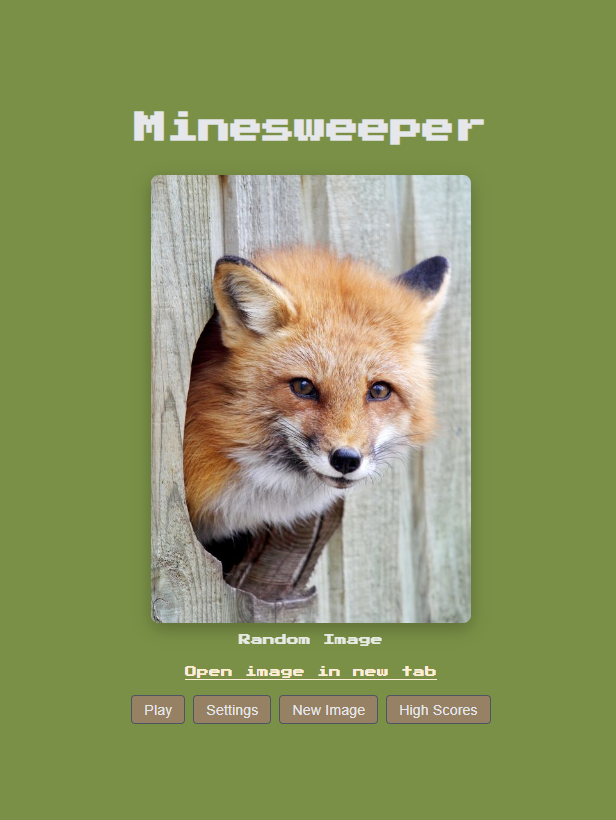
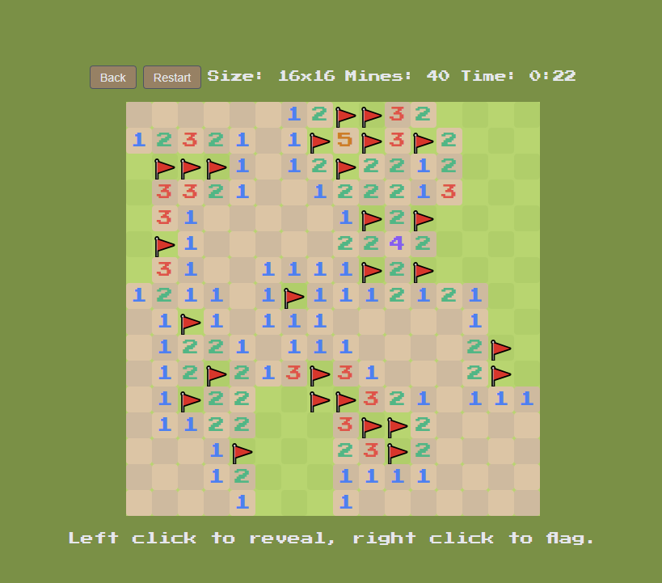
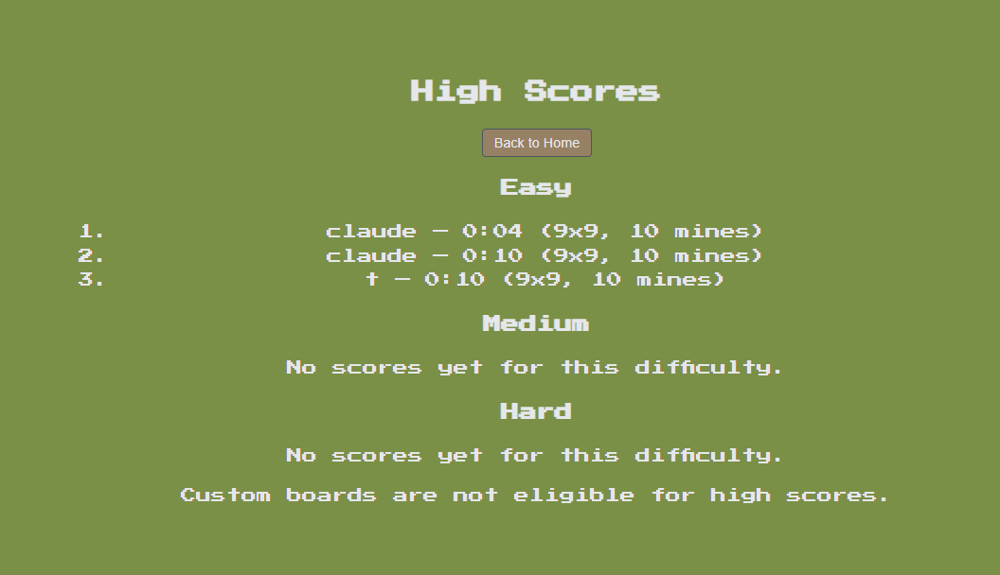
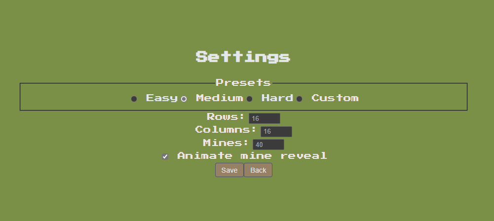

# Minesweeper SPA — project-02

A fully-featured Minesweeper single-page application built with vanilla JavaScript, featuring multiple difficulty levels, persistent high scores, and smooth animations.

**Live URL:** [https://ckluke1.github.io/csci4208-portfolio-2025/projects/project02/index.html]
**Repository:** https://github.com/ckluke1/csci4208-portfolio-2025/tree/main/projects/project02

---

## Features

### Core Gameplay
- Classic Minesweeper mechanics with reveal and flag interactions
- Three difficulty presets: Easy (9×9, 10 mines), Medium (16×16, 40 mines), Hard (16×30, 99 mines)
### UI/UX Polish
- Single-page application with client-side routing (Home, Game, Settings, High Scores)
-  Google-style animated mine reveal on loss (reveals from explosion origin outward)
-  Click anywhere to instantly finish animation
-  Settings toggle to enable/disable mine animations
-  Retro gaming aesthetic with Press Start 2P font
-  Responsive grid layout that adapts to board size

### Data Persistence
-  **Local Storage**: Game state, settings, and local high scores persist across sessions
- **Remote Storage**: JSONBin integration for global high score leaderboard
-  Automatic merge of local and remote high scores
-  Settings persistence (difficulty, animation preferences)

### High Score System
-  Categorized leaderboards: Easy, Medium, Hard (custom boards excluded for fairness)
-  Top 20 scores maintained per category
-  Local-first with optional remote sync
-  Automatic score validation and category detection

---

## Tech Stack

- **Frontend**: Vanilla JavaScript (ES6 modules)
- **State Management**: Custom pub/sub store pattern
- **Persistence**: LocalStorage + JSONBin (remote)
- **Routing**: Hash-based client-side router
- **Styling**: Custom CSS with CSS Grid
- **Public API**: Motivation quote service
- **Build**: None (native ES modules)

---

## Project Structure

```
project02/
├── index.html                    # Entry point
├── style.css                     # Global styles
├── src/
│   ├── main.js                   # App bootstrap
│   ├── router.js                 # Client-side routing
│   ├── state/
│   │   └── store.js              # Centralized state + pub/sub
│   ├── engine/                   # Game logic (pure)
│   │   ├── Game.js               # Game controller
│   │   ├── Board.js              # Board generation & operations
│   │   └── Tile.js               # Tile model
│   ├── ui/                       # View components
│   │   ├── AppView.js            # Root view switcher
│   │   ├── HomeView.js           # Landing page
│   │   ├── GameView.js           # Game board + interactions
│   │   ├── SettingsView.js       # Difficulty & preferences
│   │   └── HighScoresView.js     # Leaderboard display
│   ├── services/                 # Data & API layer
│   │   ├── localStorageService.js
│   │   ├── jsonbinService.js     # Remote high scores
│   │   └── publicApi.js          # Motivation quotes
│   └── utils/
│       └── dom.js                # DOM helpers
├── server/                       # (Optional) Express server
│   ├── index.js
│   └── storage.js
└── package.json
```

---

## How to Run Locally

### Prerequisites
- Web browser (Chrome, Firefox, Edge, Safari)
- Optional: Node.js 16+ (if using the Express server)

### Quick Start (Static SPA)

1. **Clone the repository:**
   ```bash
   git clone https://github.com/ckluke1/csci4208-portfolio-2025.git
   cd csci4208-portfolio-2025/projects/project02
   ```

2. **Serve the files:**
   
   Option A: Using Python
   ```bash
   python -m http.server 8000
   ```
   
   Option B: Using Node.js http-server
   ```bash
   npx http-server -c-1
   ```

3. **Open in browser:**
   ```
   http://localhost:8000
   ```

### Optional: Run with Express Server

The project includes an Express server for potential backend features (currently unused by the SPA):

```bash
npm install
npm start
# Server runs on http://localhost:4000
```

---

## How to Demo

### Basic Gameplay
1. Open the app and click **"New Game"** from the home screen
2. Left-click tiles to reveal, right-click (or Shift+click) to flag
3. Win by revealing all safe tiles; lose by clicking a mine
4. On loss, watch the animated mine reveal (click anywhere to skip)

### Settings & Difficulty
1. Click **"Settings"** from home or during a game
2. Select a preset: Easy, Medium, or Hard
3. Or choose Custom and enter your own dimensions
4. Toggle "Animate mine reveal" on/off
5. Click **"Save"** to start a new game with those settings

### High Scores
1. Win a game on Easy, Medium, or Hard difficulty
2. Enter your name when prompted
3. Click **"High Scores"** to view categorized leaderboards
4. Note: Custom boards don't qualify for high scores

### Remote Sync (Optional)
1. Open `src/services/jsonbinService.js`
2. Replace `YOUR_BIN_ID_HERE` and `YOUR_JSONBIN_MASTER_KEY_HERE` with your JSONBin credentials
3. High scores will sync to the cloud on each win

---

## Configuration

### JSONBin Setup (Optional)
To enable remote high score sync:

1. Create a free account at [JSONBin.io](https://jsonbin.io)
2. Create a new bin with initial content: `{"highScores": []}`
3. Copy your Bin ID and Master Key
4. Update `src/services/jsonbinService.js`:
   ```js
   const BIN_ID = 'your-bin-id-here';
   const MASTER_KEY = 'your-master-key-here';
   ```

**Security Note**: For production, use environment variables or a backend proxy. Never commit real secrets to version control.

---

## Screenshots

### Home Screen


### Game Board (Medium Difficulty)


### High Scores


### Settings

